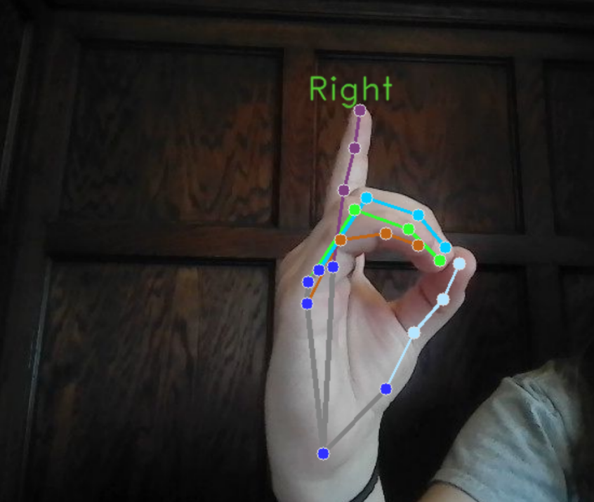
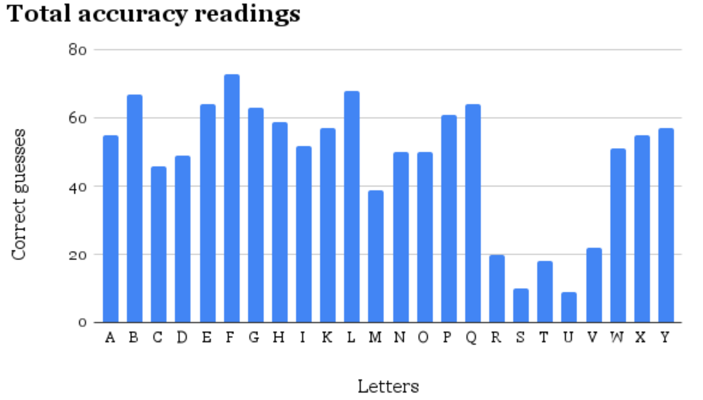
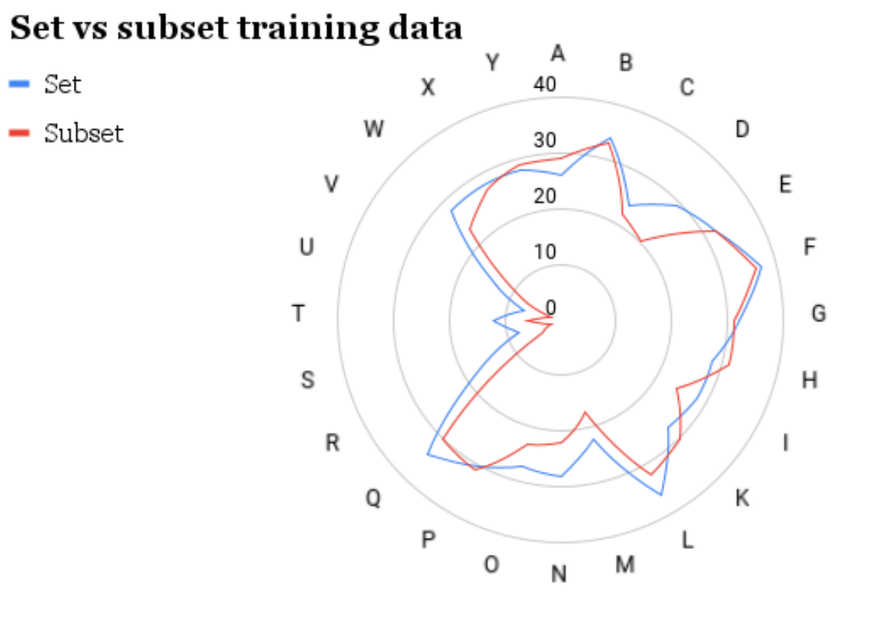

# Sign Langugae Recognition

### credits
The code of this project was written by Nathaniel Grenke, using opencv libraries.

## Project
Many people are afflicted with hearing loss or speaking deficits which make their best form
of communication sign language. This project makes use of computer vision and Singular Value Decomposition to recognise all static American Sign Language(ASL) alphabetic letters, with the goal of facilitating communication between hearing individuals and those who are deaf or hard of hearing.

## Setup
Open the “sign interpreter.ipynb” file with a Google Colab environment, and follow the next steps in the file. 

## Results
The software was tested with a small training set of 70 images. Here are some highlights:

An individual holding up the ASL sign for the letter d. This is an example of what the software “sees” in an image. Each dot has related coordinates, and these are what the software uses for recognizing the sign presented.

This averaged to an overall 60.36% accuracy

The data suggests a bigger training set yields better results, which implies more training data is needed.
